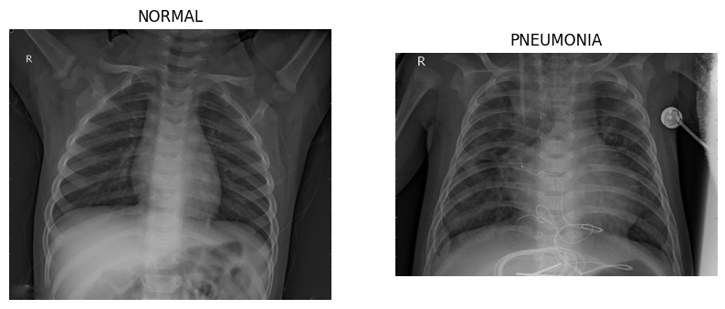
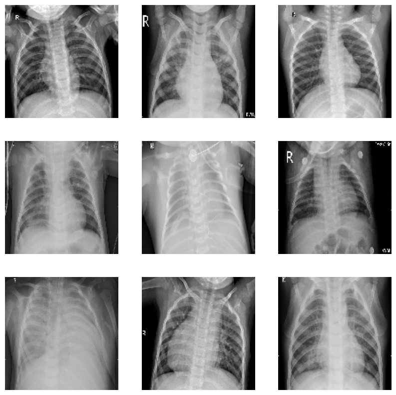
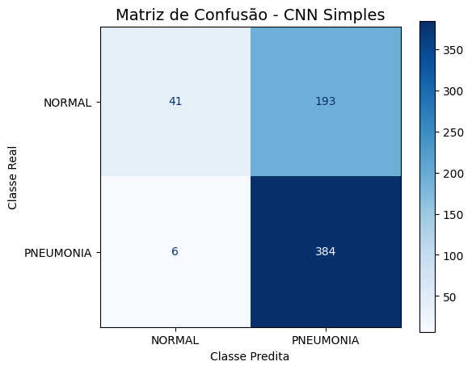
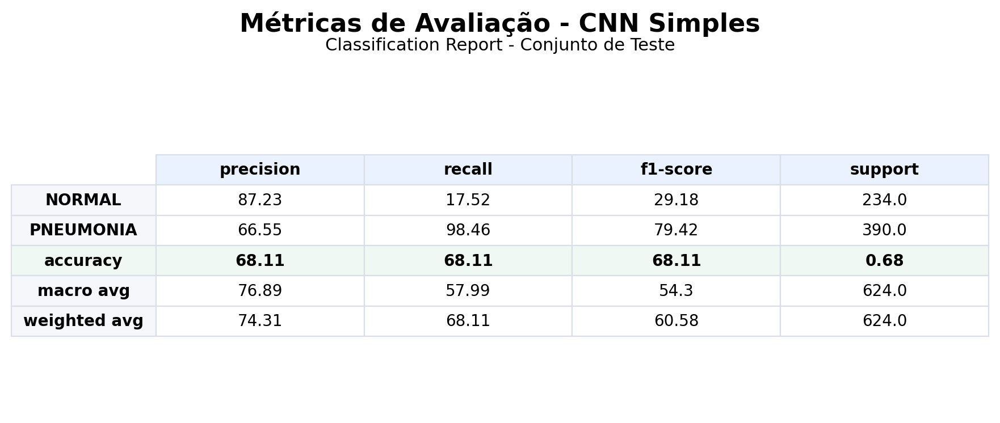
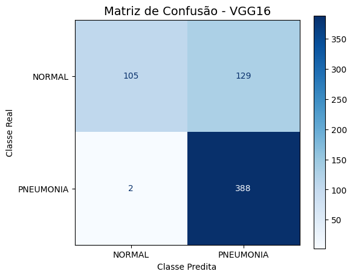
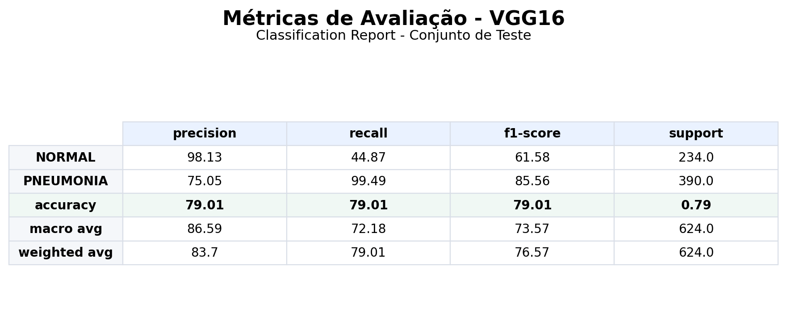
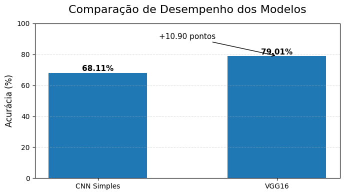

# 🌐 Fase 4 – Visão Computacional na Saúde

## 👥 Grupo 35

## 👨‍🎓 Integrantes

- Amanda Vieira Pires (RM566330)
- Ana Gabriela Soares Santos (RM565235)
- Bianca Nascimento de Santa Cruz Oliveira (RM561390)
- Milena Pereira dos Santos Silva (RM565464)
- Nayana Mehta Miazaki (RM565045)

## 👩‍🏫 Professores

### Tutor

- Caique Nonato

### Coordenador(a)

- André Godoi

---

## 🎯 Visão Geral

Nesta **Fase 4**, o projeto **CardioIA** avança para a aplicação de técnicas de **Visão Computacional** e **Aprendizado Profundo** na análise de imagens médicas. O objetivo desta etapa é explorar como modelos de Inteligência Artificial podem auxiliar na identificação de padrões presentes em exames de imagem, contribuindo para sistemas de apoio à decisão clínica.

Para isso, foi desenvolvido um fluxo completo que contempla desde a preparação dos dados até a classificação automática das imagens por meio de Redes Neurais Convolucionais (CNNs). O projeto foi dividido em duas etapas principais: a organização e pré-processamento das imagens médicas e a implementação de modelos de classificação utilizando tanto uma CNN construída do zero quanto uma abordagem baseada em Transfer Learning.

O dataset utilizado foi o **Chest X-Ray Images (Pneumonia)**, composto por radiografias de tórax classificadas nas categorias **NORMAL** e **PNEUMONIA**. Esse conjunto de dados permitiu simular um cenário realista de aplicação da Inteligência Artificial na área da saúde, demonstrando como algoritmos de Visão Computacional podem ser utilizados para identificar alterações presentes em exames médicos.

Ao final desta fase, foram avaliadas diferentes arquiteturas de redes neurais e comparados seus desempenhos por meio de métricas como acurácia, precisão, recall e F1-score, evidenciando o potencial dessas tecnologias para auxiliar profissionais da saúde em processos de análise e interpretação de exames.

---

# 📊 Parte 1 – Pré-processamento e Organização das Imagens

## 🎯 Objetivo

A primeira etapa do projeto teve como objetivo preparar um conjunto de imagens médicas para utilização em modelos de Visão Computacional. O pré-processamento é uma fase essencial em projetos de Inteligência Artificial, pois garante a padronização dos dados e contribui para um treinamento mais eficiente dos modelos.

Nesta etapa foram realizadas atividades de inspeção, organização e transformação das imagens, preparando o dataset para as etapas posteriores de classificação.

---

## 📂 Dataset Utilizado

Foi utilizado o dataset público **Chest X-Ray Images (Pneumonia)**, disponibilizado na plataforma Kaggle.

O conjunto contém radiografias de tórax classificadas em duas categorias:

- **NORMAL**
- **PNEUMONIA**

Além disso, o dataset já se encontra organizado em conjuntos de:

- Treinamento (Train)
- Validação (Validation)
- Teste (Test)

Essa estrutura facilita a preparação dos dados e permite a avaliação adequada dos modelos desenvolvidos.

### 🔗 Fonte dos Dados

https://www.kaggle.com/datasets/paultimothymooney/chest-xray-pneumonia

---

## ⚙️ Pipeline de Pré-processamento

Para garantir a consistência dos dados utilizados nos modelos de aprendizado profundo, foi implementado um pipeline de pré-processamento composto pelas seguintes etapas:

### 1. Inspeção do Dataset

Inicialmente foi realizada a análise da estrutura das pastas e da distribuição das imagens entre as classes disponíveis.

Essa etapa permitiu verificar:

- Quantidade de imagens por categoria;
- Organização dos conjuntos de treino, validação e teste;
- Integridade da base de dados.

### 2. Redimensionamento das Imagens

Todas as imagens foram redimensionadas para **128 × 128 pixels**.

A padronização das dimensões é necessária para que todas as amostras possuam o mesmo formato de entrada durante o treinamento das redes neurais.

### 3. Conversão para RGB

As imagens foram convertidas para o formato RGB, garantindo compatibilidade com arquiteturas modernas de Redes Neurais Convolucionais.

### 4. Normalização

Os valores dos pixels foram normalizados para a faixa entre **0 e 1**, utilizando a transformação:

```python
pixel_normalizado = pixel / 255.0
```

Essa etapa reduz a amplitude dos dados de entrada e contribui para maior estabilidade durante o treinamento dos modelos.

### 5. Organização dos Conjuntos

Foram utilizados os conjuntos já disponibilizados pelo dataset:

| Conjunto | Quantidade de Imagens |
|-----------|-----------:|
| Treino | 5.216 |
| Validação | 16 |
| Teste | 624 |

---

## 📈 Resultados Obtidos

Após a execução do pipeline de pré-processamento, as imagens encontravam-se devidamente organizadas, redimensionadas e normalizadas para utilização em modelos de Visão Computacional.

As transformações realizadas garantiram a padronização dos dados e prepararam o conjunto para a etapa seguinte de classificação utilizando Redes Neurais Convolucionais.

### 📷 Evidências

> Inserir imagem de exemplo do dataset



> Inserir imagem do pré-processamento



# 🧠 Parte 2 – Classificação de Imagens Médicas com CNN

## 🎯 Objetivo

Após a conclusão do pré-processamento das imagens médicas, foi iniciada a etapa de classificação utilizando Redes Neurais Convolucionais (CNNs).

O objetivo desta fase foi avaliar a capacidade de diferentes arquiteturas de Inteligência Artificial em identificar padrões presentes nas radiografias de tórax e classificar corretamente as imagens entre as categorias **NORMAL** e **PNEUMONIA**.

Para isso, foram testadas duas abordagens distintas:

- CNN Simples desenvolvida do zero;
- Transfer Learning utilizando a arquitetura VGG16 pré-treinada.

---

## 🔬 Modelo 1 – CNN Simples

## 📋 Descrição

A primeira abordagem consistiu na implementação de uma Rede Neural Convolucional construída do zero.

A arquitetura foi composta por camadas convolucionais responsáveis pela extração de características visuais, seguidas por camadas de pooling para redução da dimensionalidade dos dados e camadas densas para realizar a classificação final.

Essa abordagem tem como principal objetivo demonstrar o funcionamento básico de uma CNN aplicada a imagens médicas.

### Estrutura da Rede

- Conv2D (32 filtros)
- MaxPooling2D
- Conv2D (64 filtros)
- MaxPooling2D
- Conv2D (128 filtros)
- MaxPooling2D
- GlobalAveragePooling2D
- Dense (128 neurônios)
- Dropout (0.4)
- Dense (1 neurônio - Sigmoid)

---

## 📊 Resultados da CNN Simples

| Métrica | Resultado |
|----------|----------:|
| Accuracy | 68,11% |
| Loss | 0,8244 |

A CNN simples conseguiu aprender padrões relevantes presentes nas radiografias, porém apresentou limitações na generalização dos dados quando comparada ao modelo baseado em Transfer Learning.

### 📷 Evidências

> Inserir print da matriz de confusão



> Inserir print das métricas



---

## 🚀 Modelo 2 – Transfer Learning com VGG16

## 📋 Descrição

A segunda abordagem utilizou a técnica de **Transfer Learning**, aproveitando a arquitetura VGG16 previamente treinada no dataset ImageNet.

Nesse método, as camadas convolucionais da VGG16 foram utilizadas como extratoras de características, enquanto novas camadas densas foram adicionadas para adaptação ao problema de classificação binária.

O uso de modelos pré-treinados permite aproveitar conhecimentos adquiridos em grandes bases de imagens, reduzindo o tempo de treinamento e aumentando a capacidade de generalização.

### Estrutura da Rede

- Base VGG16 pré-treinada
- GlobalAveragePooling2D
- Dense (128 neurônios)
- Dropout (0.4)
- Dense (1 neurônio - Sigmoid)

---

## 📊 Resultados do VGG16

| Métrica | Resultado |
|----------|----------:|
| Accuracy | 79,01% |
| Loss | 0,5081 |

### Métricas de Classificação

| Classe | Precision | Recall | F1-Score |
|----------|----------:|----------:|----------:|
| NORMAL | 98% | 45% | 62% |
| PNEUMONIA | 75% | 99% | 86% |

O modelo apresentou excelente desempenho na identificação de casos de pneumonia, alcançando recall de 99%, o que demonstra elevada capacidade de detectar imagens pertencentes à classe positiva.

### 📷 Evidências

> Inserir print da matriz de confusão



> Inserir print das métricas



---

## 📈 Comparação entre os Modelos

## 🎯 Objetivo da Comparação

Após o treinamento e avaliação dos dois modelos propostos, foi realizada uma análise comparativa para verificar o impacto do uso de Transfer Learning na classificação das imagens médicas.

A comparação permite identificar as vantagens e limitações de cada abordagem, além de demonstrar como arquiteturas pré-treinadas podem contribuir para melhorar o desempenho de sistemas de Visão Computacional aplicados à saúde.

---

## 📊 Comparação de Desempenho

| Modelo | Accuracy | Loss |
|----------|----------:|----------:|
| CNN Simples | 68,11% | 0,8244 |
| VGG16 | 79,01% | 0,5081 |

Observa-se que o modelo VGG16 apresentou desempenho superior ao modelo desenvolvido do zero, alcançando uma melhoria de aproximadamente **11 pontos percentuais na acurácia**.

---

## 📉 Gráfico Comparativo

> Inserir gráfico de comparação das acurácias



---

## 🔍 Análise dos Resultados

A CNN simples demonstrou capacidade de aprender padrões presentes nas radiografias de tórax, alcançando resultados satisfatórios para um protótipo inicial. Entretanto, por ter sido treinada do zero e possuir uma arquitetura mais simples, apresentou limitações na capacidade de generalização para novos dados.

Por outro lado, o modelo VGG16 apresentou desempenho significativamente superior. A utilização de Transfer Learning permitiu aproveitar características visuais previamente aprendidas durante o treinamento no ImageNet, tornando o processo de classificação mais eficiente.

Além da melhoria na acurácia, o VGG16 apresentou excelente desempenho na identificação de casos de pneumonia, alcançando recall de 99% para essa classe. Esse resultado é particularmente importante em aplicações médicas, onde a correta identificação de possíveis alterações clínicas possui grande relevância.

Os resultados obtidos demonstram que o uso de arquiteturas pré-treinadas pode representar uma estratégia eficiente para aplicações de Inteligência Artificial na saúde, especialmente em cenários com conjuntos de dados limitados.

---

## 🏆 Melhor Modelo

Com base nos resultados obtidos, o modelo **VGG16** foi considerado a melhor abordagem para o problema proposto.

### Principais vantagens observadas:

- Maior acurácia geral;
- Melhor capacidade de generalização;
- Excelente desempenho na identificação de casos de pneumonia;
- Menor valor de loss;
- Aproveitamento de conhecimento prévio por meio de Transfer Learning.

Dessa forma, o VGG16 demonstrou maior potencial para utilização em sistemas de apoio à análise de exames médicos baseados em imagens.

---

# 🏁 Conclusão

Nesta fase do projeto **CardioIA**, foi possível aplicar técnicas de **Visão Computacional** e **Aprendizado Profundo** na análise de imagens médicas, demonstrando como a Inteligência Artificial pode auxiliar na identificação de padrões relevantes para a área da saúde.

Inicialmente, foi realizado o pré-processamento das radiografias de tórax, incluindo etapas de organização, redimensionamento, conversão de formato e normalização das imagens. Essas transformações garantiram a padronização dos dados e prepararam o conjunto para o treinamento dos modelos de classificação.

Em seguida, foram desenvolvidas duas abordagens distintas utilizando Redes Neurais Convolucionais. A primeira consistiu em uma CNN simples treinada do zero, enquanto a segunda utilizou a técnica de Transfer Learning com a arquitetura VGG16 pré-treinada.

Os resultados demonstraram que ambos os modelos foram capazes de identificar padrões presentes nas imagens médicas. Entretanto, o modelo VGG16 apresentou desempenho superior, alcançando **79,01% de acurácia**, enquanto a CNN simples atingiu **68,11%**. Além disso, o VGG16 apresentou excelente capacidade de identificação de casos de pneumonia, obtendo **99% de recall** para essa classe.

De modo geral, os experimentos realizados evidenciam o potencial das técnicas de Visão Computacional como ferramentas de apoio à análise de exames médicos. Embora o sistema desenvolvido tenha caráter acadêmico e utilize dados públicos para fins educacionais, os resultados obtidos demonstram como soluções baseadas em Inteligência Artificial podem contribuir para tornar processos de análise mais rápidos, consistentes e eficientes.

---

# 🛠 Tecnologias Utilizadas

## Linguagens e Bibliotecas

- Python 3
- TensorFlow / Keras
- NumPy
- Pandas
- Matplotlib
- Scikit-Learn

## Técnicas Aplicadas

- Pré-processamento de Imagens
- Normalização de Dados
- Redes Neurais Convolucionais (CNN)
- Transfer Learning
- Classificação Binária
- Avaliação de Modelos de Machine Learning

## Ambiente de Desenvolvimento

- Google Colab
- Jupyter Notebook
- Git e GitHub

